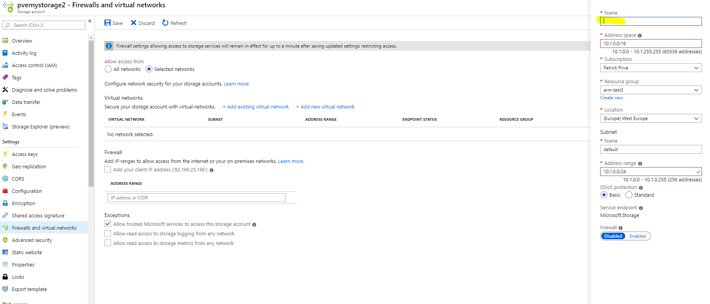
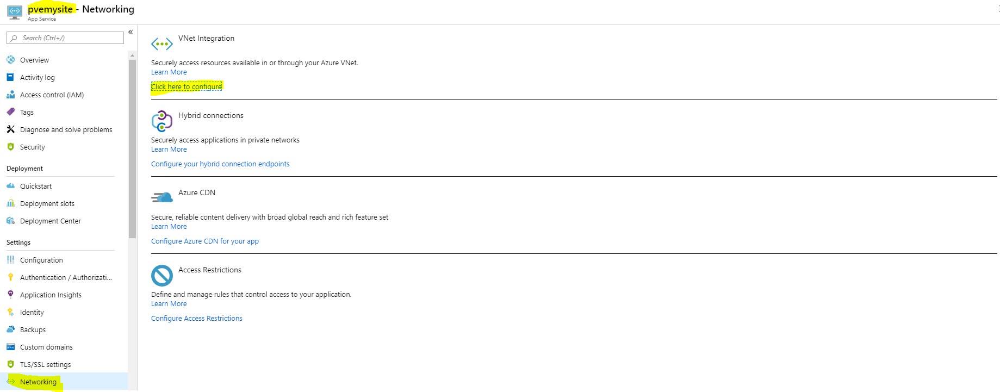
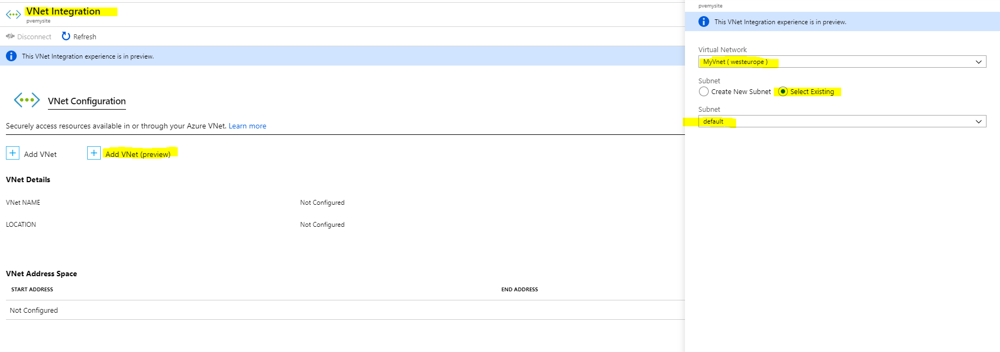

# Isolating Resources with Virtual Networks

## Connect Storage Account to Vnet

Go to your **storage account**, navigate to "**Firewalls and Virtual Networks**". Select "allow acces from **selected networks**".  Create a **Virtual network**. 

You only have to enter a name and leave the rest default.

**Save** your **settings** to your storage account.

We need to enable the **storage endpoint** on the VNet.

You'll see that **"endpoint status"** is disabled.

**Visit your website** again, you should get an **error now** since the website is not yet connected to the virtual network.

So let's connect the **website**. Go to the **Networking** part of the website and **configure vnet integration**.

**Connect** to the Vnet.

## Configure the Vnet

Go back to the **storageaccount** in the portal, go to Firewall and virtual networks.

Click it and, open the "Default" **subnet** where it says **"Endpoint disabled"**.

Tick the box on the **Microsoft.Storage** and press save.

## Done

Now it might take a while for azure to configure all your settings and networking.

You can try restarting your website and check if it works again in isolated mode.